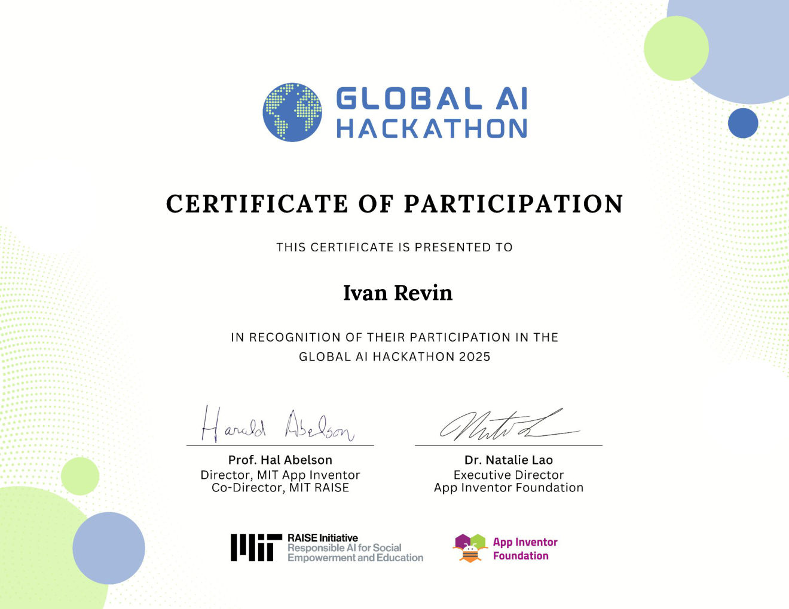

# satgpt

Backend for the MIT Generative AI Hackathon project.

This is an app that creates a quiz from an uploaded PDF file. The motivation is to
generate quizzes and pair them with [spaced repetition](https://en.wikipedia.org/wiki/Spaced_repetition)
to support the learning process.

The server extracts information from the uploaded file and generates a quiz. The
user can define the number of questions. Two response formats are supported:

- **JSON** — used by the mobile app built for the hackathon.
- **Markdown** — can be converted to Anki-compatible flashcards for spaced repetition.

## Hackathon materials

- [Presentation](pdf/Global%20AI%20Hackathon%202025%20-%20Presentation.pdf)
- [Participant Certificate](pdf/Global%20AI%20Hackathon%202025%20-%20Participant%20Certificate.pdf)

[](pdf/Global%20AI%20Hackathon%202025%20-%20Participant%20Certificate.pdf)

## How it works

1. A PDF is uploaded to the Flask server (`main.py`).
2. `process_file.py` loads and splits the PDF, embeds it, and uses a
   LangChain `RetrievalQA` chain (OpenAI `gpt-4o-mini`) to generate quiz
   questions grounded in the document's content.
3. `extract_quiz.py` parses the generated text into a structured `Quiz`
   object (via the OpenAI structured-output API) and returns it as JSON.

## Requirements

- Python >= 3.11
- [uv](https://docs.astral.sh/uv/)
- An [OpenAI API key](https://platform.openai.com/api-keys)

## Install

Clone the repo and install dependencies with `uv` (uses the included `uv.lock`):

```bash
git clone https://github.com/revinivan/quizai.git
cd quizai
uv sync
```

Create a `.env` file in the project root with your OpenAI API key:

```bash
OPENAI_API_KEY=sk-...
```

## Usage

Start the server:

```bash
uv run main.py
```

The server listens on `http://0.0.0.0:3000` by default (override with the
`PORT` environment variable).

### Upload a PDF and get a quiz

Using `multipart/form-data`:

```bash
curl -X POST http://localhost:3000/ \
  -F "file=@/path/to/document.pdf"
```

Using a raw PDF body (`application/x-www-form-urlencoded`):

```bash
curl -X POST http://localhost:3000/ \
  -H "Content-Type: application/x-www-form-urlencoded" \
  --data-binary @/path/to/document.pdf
```

Either request returns a JSON quiz object, e.g.:

```json
{
  "topic": "Particle Theory, Bonding, and Atomic Structure",
  "source_document": "uploads/spasenie.pdf",
  "questions": [
    {
      "question": "What is the smallest particle an element can be separated into while still being the same substance?",
      "corect_answer": 1,
      "answers": ["Molecule", "Atom", "Compound", "Ion"]
    },
    {
      "question": "According to the kinetic particle theory, what describes all matter?",
      "corect_answer": 0,
      "answers": [
        "A collection of particles in constant, random motion",
        "A fixed arrangement of particles",
        "Particles that are stationary",
        "Particles that only vibrate at high temperatures"
      ]
    }
  ]
}
```

A real response contains one entry per generated question (20 by default,
per the prompt in `process_file.py`) — truncated here for brevity.

You can also open `http://localhost:3000/` in a browser for a simple file
upload form.

## Deployment

### Google Cloud Run

```bash
gcloud run deploy --source .
```

To attach an in-memory volume for the `uploads` directory:

```bash
gcloud run deploy --source . \
  --add-volume="name=uploads-in-memory-volume,type=in-memory,size-limit=1024Mi" \
  --add-volume-mount="volume=uploads-in-memory-volume,mount-path=/uploads"
```

### VPS

1. **Provision the server.** Install Python 3.11+ and `uv`:

   ```bash
   curl -LsSf https://astral.sh/uv/install.sh | sh
   ```

2. **Clone and install.**

   ```bash
   git clone https://github.com/revinivan/quizai.git
   cd quizai
   uv sync
   ```

3. **Configure secrets.** Create a `.env` file in the project root:

   ```bash
   OPENAI_API_KEY=sk-...
   ```

4. **Run it with `start.sh`.** The included script serves the app with
   `gunicorn` instead of Flask's dev server:

   ```bash
   ./start.sh
   ```

   It binds to `0.0.0.0` on `$PORT` (default `3000`), so it's reachable from
   outside the box immediately.

5. **Keep it running with systemd.** Create
   `/etc/systemd/system/quizai.service`:

   ```ini
   [Unit]
   Description=quizai
   After=network.target

   [Service]
   User=quizai
   WorkingDirectory=/opt/quizai
   EnvironmentFile=/opt/quizai/.env
   ExecStart=/opt/quizai/start.sh
   Restart=always

   [Install]
   WantedBy=multi-user.target
   ```

   Then enable it:

   ```bash
   sudo systemctl daemon-reload
   sudo systemctl enable --now quizai
   ```

6. **(Public-facing only) Put nginx + TLS in front.** If the VPS is exposed
   to the internet on a domain, don't expose gunicorn directly — proxy it
   through nginx and terminate TLS with Let's Encrypt:

   ```nginx
   server {
       listen 80;
       server_name your-domain.example;

       client_max_body_size 300M;  # match MAX_CONTENT_LENGTH in main.py

       location / {
           proxy_pass http://127.0.0.1:3000;
           proxy_set_header Host $host;
           proxy_set_header X-Forwarded-For $proxy_add_x_forwarded_for;
       }
   }
   ```

   Then point gunicorn at `127.0.0.1` instead of `0.0.0.0` (edit `start.sh`),
   and run `sudo certbot --nginx -d your-domain.example` to get HTTPS. Only
   open ports 80/443 on the firewall; keep gunicorn's port closed to the
   outside world.

   If you're deploying to a private/LAN-only machine instead, skip this step
   — `start.sh` binding to `0.0.0.0:3000` is enough to reach it from other
   machines on the same network.
